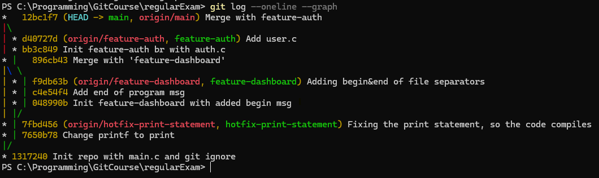

## Git History after Ex 1:



### Pre-commit script:
```bash
#!/bin/bash

# Format JS files with Prettier (only in JS folder)
echo "🔧 Running Prettier formatting..."
JS_FILES=$(git diff --cached --name-only --diff-filter=ACM | grep '^Js/.*\.js$')

if [ -n "$JS_FILES" ]; then
  npx prettier --write $JS_FILES
  echo "📥 Adding formatted JS files back to staging..."
  git add $JS_FILES
fi
```

### Commit-msg script:
```bash
#!/bin/bash

COMMIT_MSG_FILE=$1
COMMIT_MSG=$(cat "$COMMIT_MSG_FILE")

# Require format: TASK-123: Some message
PATTERN="^TASK-[0-9]+: .+"

if [[ ! "$COMMIT_MSG" =~ $PATTERN ]]; then
  echo "❌ Commit message must match pattern: TASK-123: Your message"
  exit 1
fi
```

### Pre-push script:
```bash
#!/bin/bash

echo "🚀 Running pre-push tests..."

# Run all Mocha tests under Js/
npx mocha "Js/test/**/*.test.js"

if [ $? -ne 0 ]; then
  echo "❌ Tests failed. Push aborted."
  exit 1
else
  echo "✅ All tests passed. Proceeding with push."
fi
```
